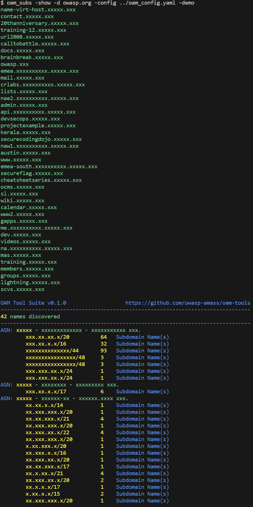
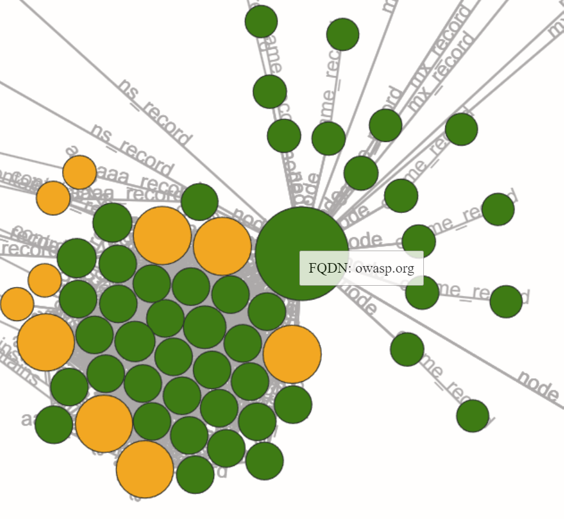

# Comprehensive Guide to OAM Tools


Delve into the functionalities of OAM's suite of command-line tools. Whether you're transitioning configurations, mapping complex IT structures, tracking domain changes, or visualizing intricate relationships, this guide provides detailed insights and usage examples to harness the full potential of OAM tools.

We will go over the following tools:

| Tool    | Description |
|:-------------|:-------------|
| [oam_subs](#the-oam_subs-command) | Analyze collected OAM assets|
| [oam_track](#the-oam_track-command) | Analyze collected OAM data to identify newly discovered assets|
| [oam_viz](#the-oam_viz-command) | Analyze collected OAM data to generate files renderable as graph visualizations|

---
## The 'oam_subs' Command

For enterprises with sprawling IT infrastructures, understanding every facet of their assets becomes a necessity. `oam_subs` offers a solution by mapping out these complex structures. Through extracting and analyzing data from the graph database, users can get a holistic view of their assets, swiftly identify potential vulnerabilities, and optimize IT operations. It's an indispensable tool for both operational efficiency and robust cybersecurity.

**Example 1: View Domain**
```bash
oam_subs -show -d example.com
```
Retrieve all available details about `example.com` from the graph database. Ideal for gaining a quick insight into a particular domain's assets.

**Example 2: Censor Output for Demonstrations**
```bash
oam_subs -demo -d example.com,example2.com
```
Mask sensitive data while presenting details of selected domains. Essential for demonstrations, webinars, or workshops where confidentiality is paramount.

**Example 3: Show IP Addresses for Discovered Names**
```bash
oam_subs -show -ip -d example.com
```
Expose the IP addresses associated with names linked to `example.com`. Perfect for analysts tracking IP distribution for a domain.

**Example 4: Show IPv4 Addresses for Discovered Names**
```bash
oam_subs -show -ipv4 -d example.com
```
Focus exclusively on IPv4 addresses associated with `example.com`. Beneficial when differentiating between IPv4 and IPv6 assets.

**Example 5: Print Only Discovered Names**
```bash
oam_subs -names -d example.com
```
Concentrate on the domain names related to `example.com` without delving into additional details. Useful for swift audits or enumerations.

**Example 6: Save Output to Text File**
```bash
oam_subs -names -o results.txt -d example.com
```
Archive the results for future reference. Vital for teams that require documentation or aim to compare findings over time.

**Example 7: Display ASN Table Summary**
```bash
oam_subs -summary -d example.com
```
Present a succinct overview of the Autonomous System Numbers associated with the domain. This is crucial for network analysts interested in understanding the ASN landscape of a domain.

This example shows the use of oam_subs against owasp.org. The configuration is set to reach a remote database. For more information in regards to configuration, please visit the [configuration users' guide](https://github.com/owasp-amass/config/blob/master/docs/user_guide.md).


---

## The 'oam_track' Command

In an era where digital assets change rapidly, enterprises need to stay updated about alterations to their asset profiles. `oam_track` serves this need, enabling businesses to swiftly detect and analyze changes across their domain enumerations. By doing so, they can monitor digital expansions, validate security policies, and ensure consistent brand representation.


**Example 1: Show Differences for a Domain**
```bash
oam_track -d example.com
```
Directly compare enumerations for `example.com` to detect changes. Useful for security analysts seeking an overview of subdomain adjustments on a single domain.

**Example 2: Tracking Multiple Domains**
```bash
oam_track -d example.com,example2.com
```
Simultaneously monitor changes for both `example.com` and `example2.com`. Perfect for organizations that want to keep tabs on multiple properties at once.

**Example 3: Using Date Format to Exclude Enumerations**
```bash
oam_track -since "01/01 15:04:05 2022 MST"
```
Focus on enumerations after January 1st, 2022. Beneficial for isolating findings within a specific timeframe, such as after a major deployment or incident.

**Example 4: Show Differences for Specific Domain from File**
```bash
oam_track -df domains.txt
```
Extract and track changes for domains from `domains.txt`. This approach simplifies tracking for users managing a plethora of domains, centralized in a single file.

---

## The 'oam_viz' Command

The digital realm thrives on connections and interdependencies. With `oam_viz`, these intricate relationships become tangible. The command transforms raw data into clear network graph visualizations, empowering analysts and cybersecurity experts to easily decipher and analyze the web of relationships within asset data. This visual clarity is instrumental for robust cyber strategy planning and effective decision-making.

**Example 1: D3 Visualization**
```bash
oam_viz -d3 -d example.com
```
Render a D3 v4 force simulation HTML visualization for `example.com`. This is valuable for users wanting interactive, web-based visualizations directly in their browsers.

**Example 2: Generate DOT Output**
```bash
oam_viz -dot -d example.com
```
Craft a DOT output for `example.com`. This format is optimal for those looking to use tools like Graphviz for custom graph renderings.

**Example 3: Output to GEXF Format**
```bash
oam_viz -gexf -d example.com
```
Export the data into the Graph Exchange XML Format (GEXF) for `example.com`. This choice is beneficial for individuals working with graph analysis software, such as Gephi.

**Example 4: Generate Output for Multiple Domains**
```bash
oam_viz -d3 -d example.com,example2.com
```
Simultaneously produce visualizations for multiple domains, making it ideal for projects that involve analyzing inter-domain relationships or comparing domain landscapes.

**Example 5: Specifying Directory for Output Files**
```bash
oam_viz -dot -o /path/to/directory -d example.com
```
Determine where the DOT file for `example.com` gets saved. Essential for organization and ensuring results are conveniently stored in project-specific locations.

**Example 6: Naming Output Files with Prefix**
```bash
oam_viz -gexf -oA myprefix -d example.com
```
Customize the file name with a chosen prefix, which can streamline file management and ensure quick identification during intensive analysis sessions.

**Example 7: Use File to Provide Domain Names for Visualization**
```bash
oam_viz -d3 -df domains.txt
```
Facilitates bulk visualization tasks by using a file list of domains. It's perfect for larger projects where manual domain input isn't feasible due to volume.

The below command generates a d3-force HTML graph based on the graph database stored within the "oam4owasp" folder:
```bash
oam_viz -d3 -dir oam4owasp -config ../oam_config.yaml -d owasp.org
```


---
